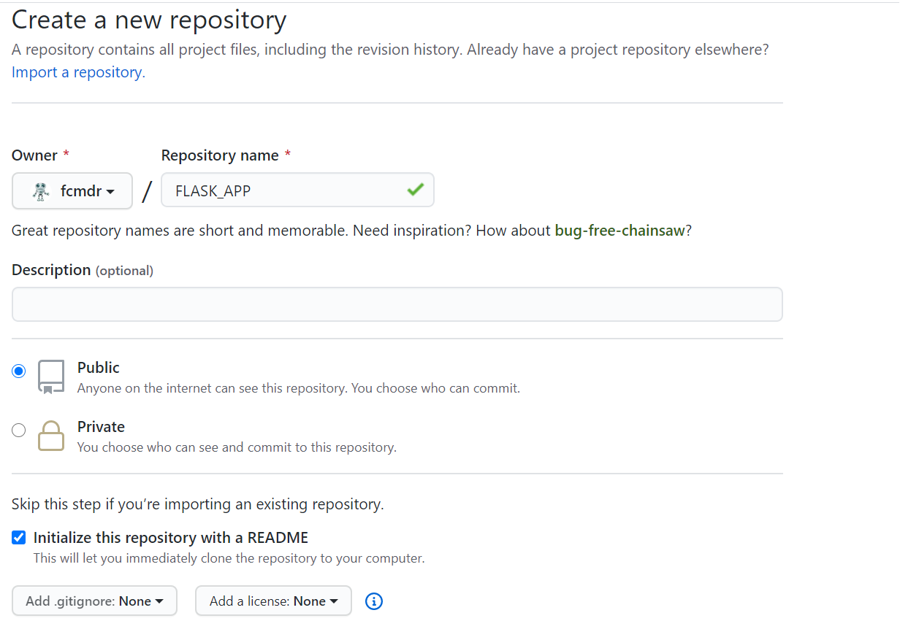
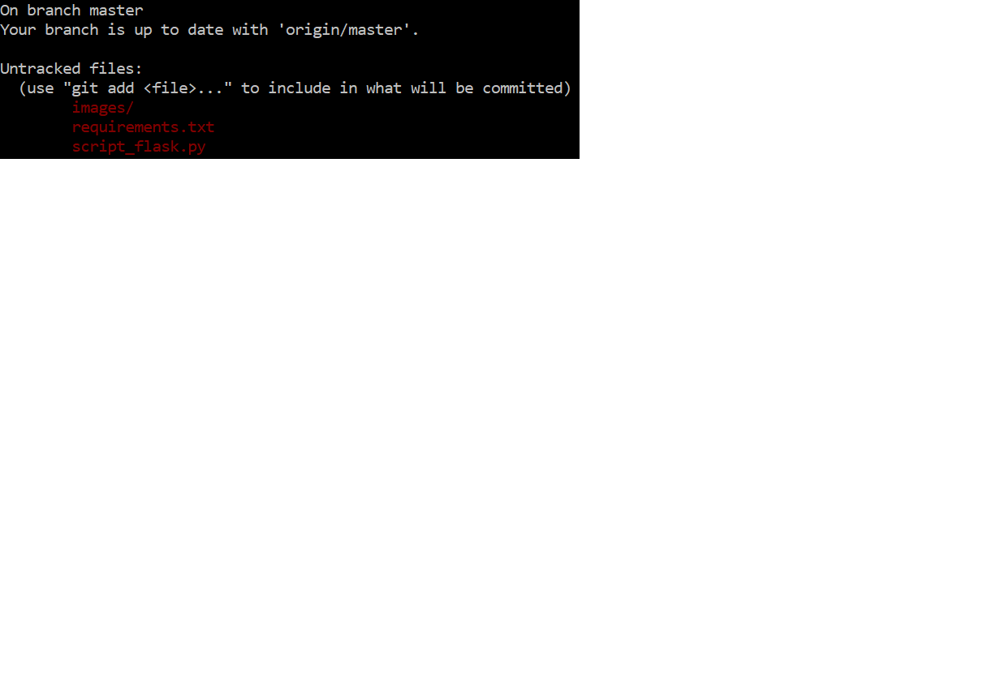
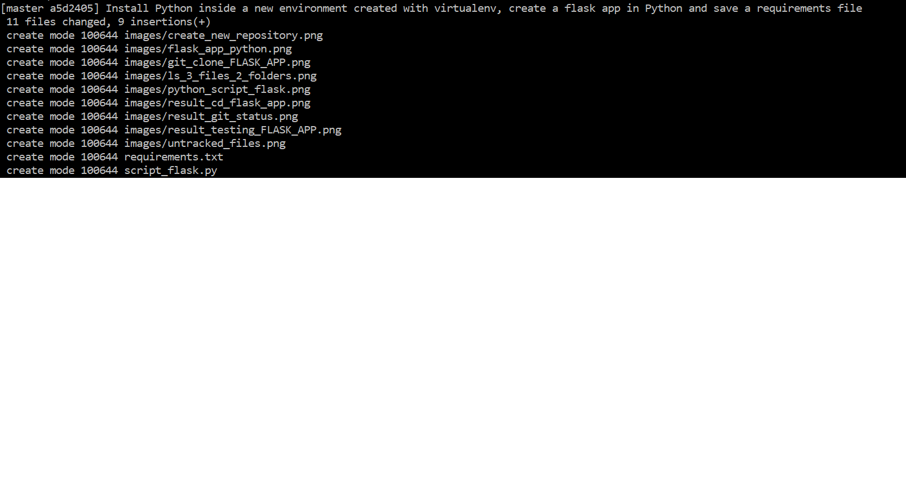

# Create an Hello World Flask application
## Goals :
- Create a flask application displaying "Hello world" on a webpage. 
- Explanation of the steps in detail using Linux commands and Git to publish the tutorial on Github.

### What will we accomplish using this tutorial ?

- First we will begin by building a repository (with its readme file) on Github.
- Then we will clone it on our local computer and build our Flask application on Python. 
- Finally we will test our Flask application. As soon as we are insured the app works we will publish our work on Github ! 
Let's go !

## I. Create a repository on Github and replicate it in local
First we create from Github a new repository and give it a name. You can choose the name you want, here i called it "FLASK_APP". You can also decide to make it public or not. Here is a snapshot of what you should obtain :

#### Make sure to tick the box "Initialize this repository with a README"

_Remark_ : The OS of my computer is Windows 10 but i found more comfortable to use Linux to create this app. 
I downloaded Ubuntu 10.04 which use the Linux OS. 

We should place ourselves in the location (in local) in which we want to put the new folder "FLASK_APP".
This is done using the command cd (change directory) :
`cd FLASK_APP`

By using the command `ls` you should get only a README file (same as in your remote Github repository).
Now we create an image folder to put images inside (the images of the tutorial for example) using :
`mkdir images`

## II. Create the flask application using Python
### 1. Create a new environment and install Python with the Flask library
Create a new environment using virtualenv by launching the following commands :
`sudo apt update`

`sudo apt install python3-virtualenv`

`pip3 install virtualenv==20.0.23`

`sudo virtualenv flask_helloworld`

To activate the environment we should  go inside the location where the environment is :

`cd flask_helloworld/bin/`

then we activate it using : `source activate`

Install Python inside our environment **'flask_helloworld'** following commands to install Python 3.6 and pip :

`sudo apt update`

`sudo apt install python3.6`

`sudo apt install python3-pip`

Install the Python library Flask :
`sudo pip3 install Flask`
### 2. Fill the Python script and save the requirements file

Using a text editor like nano (which is already set in Linux) you can create a Python script by typing `nano script_flask.py` containing the Flask application written in Python :
`nano script_flask.py`
Inside the script we can fill it with the Python code that will run our Flask application :

First we import Flask from the flask library, then we create an instance of the class Flask then we define a **"route"** that will execute the **"home"** function displaying("Hello World") !
After we are done press Ctrl+X and save to exit the nano editor.
We create a requirements file so anybody who wants can replicate our environment and use it :
`pip3 freeze > requirements.txt`

## III. Test the application and publish it on Github

### 1. Test the Flask application

Before publishing our work let's check if the flask app works fine :
`sudo python3 script_flask.py`
Then copy and paste the weblink which is given in your navigator : `http://127.0.0.1:5000/`
Final result : 

### 2. Push our work on Github 

Great, the app works well, let's "push" our work on Github now !
By typing `ls` we see that we have inside our repository 3 files and 2 folders : 

Now we use another git command : The `git status` command we execute it and we obtain :

You will see that the **image folder**, **the requirements** and the **script_flask** files are in red meaning they are not in the **staging area** nor in the remote github repository. So we put the files in the staging area using the **"git add ."** command (the dot means all files).
Putting files in the staging area means the modifications are ready to be **"committed"** (or saved) by putting a comment describing the change we have applied thanks to the **git commit** command :
`git commit -m "Install Python inside a new environment created with virtualenv, create a flask app in Python and save a requirements file`
Result of the **git commit** command :

Remark : The Flask app we have just built is working on our computer in local

Pushing means publish the work on Github this schema summarize the direction of each git command :

Now we can push our work using the **git push** command :

### Congratulations you have now set a Flask application using Linux and Python and published it on GitHub !!!
